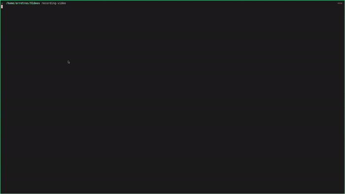

# Notes Diagram 
> Un simple diagrama interactivo con mis apuntes

La idea es representar mis apuntes de forma jerárquica (como un mapa mental) para facilitar la memorización de los conceptos mediante el uso de una "ruta/hilo" de ideas.

## Diagrama

El diagrama es una representación de una `máquina de estado finito` (utilizando las bibliotecas xstate y dagre-d3), un `tabla de transición de estados` es utilizada para describirla.

Es posible:

* Mover el diagrama:
   click (sobre el diagrama, sin soltar) más  movimientos de mouse 

* Zoom in: 
   click doble (sobre el diagrama)

* Zoom out :
   shift más click doble (sobre el diagrama)




## Comentarios acerca del código 

En general el código está estructurado siguiendo la idea de: 


`datos\domain`[`estado` + `entrada`] => `transformación` =>  `salida`


Datos\Domain:
 Hasta el momento en inglés (la mayoría de la información es de wikipedia u otras páginas de internet).

``` javascript
// data/data.js
const STATE_DATA = {
	"STATE": {
		"content": [
			"...",
		  "... "
		],
		  "image": [""]
   },
``` 

- Entrada de usuario:

   Teclado (principalmente las flechas)

``` javascript
 document.addEventListener("keydown", function (evt) {
	 switch(evt.key) {
		 case 'ArrowDown':
           ndmMachineService.send('d')
			break;
            ...
	 }
 });
```

- La tabla de transición  describe:
 - El `estado` actual
 - La `entrada` que produce la transición (al siguiente estado válido) 
 - El `siguiente estado` 

``` javascript
// js/statetransitiontable.js

const stateTransitionTable =
`
id: ndm
*NDM                d    POPULATION-SAMPLE

 POPULATION-SAMPLE  r    CENTRAL-TENDENCY 
 POPULATION-SAMPLE  l    CENTRAL-VARIATION
 POPULATION-SAMPLE  u    NDM 

 CENTRAL-VARIATION  l    RANGE 
 CENTRAL-VARIATION  r    PERCENTIL 

 CENTRAL-TENDENCY   l    MODE
 CENTRAL-TENDENCY   d    MEDIAN
 CENTRAL-TENDENCY   r    MEAN

 MODE               u    CENTRAL-TENDENCY
 MEDIAN             u    CENTRAL-TENDENCY
 MEAN               u    CENTRAL-TENDENCY 

 MEAN               d    TRIMMEDMEAN 
 TRIMMEDMEAN        u    MEAN 

 TRIMMEDMEAN        d    OUTLIERS

 OUTLIERS           u    TRIMMEDMEAN

 CENTRAL-TENDENCY   u    POPULATION-SAMPLE	
 CENTRAL-VARIATION  u    POPULATION-SAMPLE	

 RANGE              u    CENTRAL-VARIATION 
 PERCENTIL          u    CENTRAL-VARIATION 
`;
```

- Efectos secundarios (`transformación`):

   Los efectos secundarios son ejecutados por el interprete (biblioteca xstate), la función showFn (actualiza el diagrama) y la función fmt (actualiza la página): 


``` javascript
// js/script.js
  const ndmMachineService   = interpret(ndmMachine)
          .onTransition(state => {
	      fmt(STATE_DATA[state.value])
          showFn(state,g.g);
        }
  );
```

``` javascript
// js/script.js
function fmt(data) {
 textDescription.textContent = '';

 data['content'].forEach( item => {
	 p = document.createElement('p');
     p.appendChild(document.createTextNode(item));
     textDescription.appendChild(p);
	});

 data['image'].forEach( item => {
     if(item.length >= 1) { 
        img = document.createElement('img');
        img.src   = item;
        textDescription.appendChild(img);
     }
    });
}
```

## Demo

[Notes Diagram](https://diegoperezm.github.io/notes-diagram/index.html)


## Licensing

"The code in this project is licensed under MIT license."

